# ProgressSoft Assignment


## Linux

#### 1.Bash Scripting 

Below is the source code for the Bash script developed for Task 1.

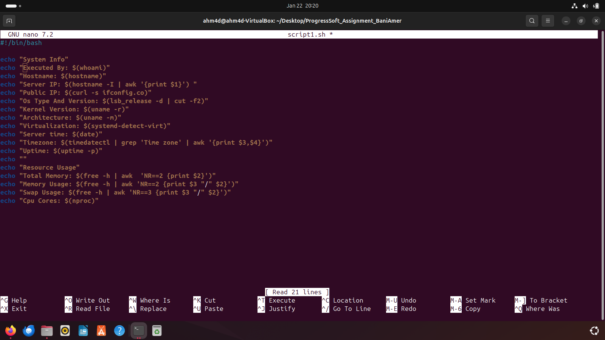

Bash script to fetch system details as required. Everything is written to match the task output as requested.

**Note that the script should be executable using the command `chmod +x script.sh` before running the script.**

* Output of the script


 
### 2.Creating a new user, primary and secondary groups 
 


### 3.Modifying root password


### 4.Installing MySQL and HAProxy

I installed the both using simple commands as shown below:

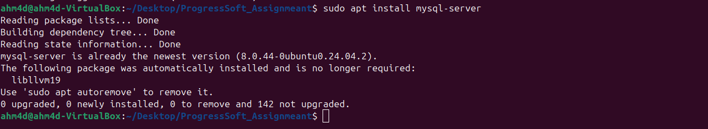


### 5.Configuring firewall rules as required


* I verified that the rules are correctly set and working using the command `ufw status` and as shown below:

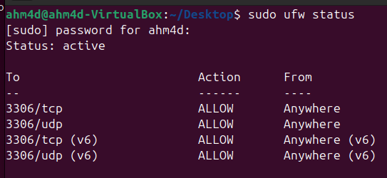

### 6.Copying a simple file from my local machine to the VM 

Firstly i installed the ftp on my VM using the command `sudo apt install vsftpd` , then on my local machine which runs Windows 11 i opened CMD and connected to the VM using the ip of it using the command `ftp *IP-ADDRESS*` 

The file i transferred is named *test.txt* from my Desktop as shown below:


The photo below verifies the transferred file using ftp.


## SQL

### Q1. Creating the required tables

I solved the task in a Linux environment using MySQL. I created a database named `progresssoft_DB`  using the commands 
```sql
create database progresssoft_db; 
use progresssoft_db;
```

All tables were created according to the task requirements, using the right data types and constraints like *Primary Keys*, *Foreign Keys*, and *Check constraints* to keep the data accurate and consistent.

The images i will provide below will show the creation of the tables:

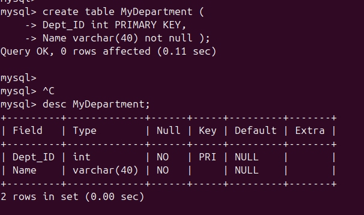
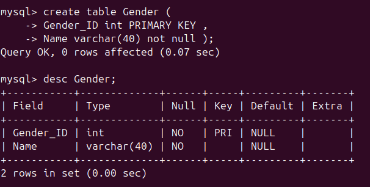
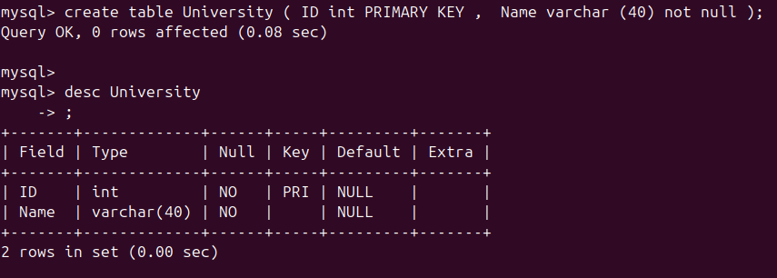
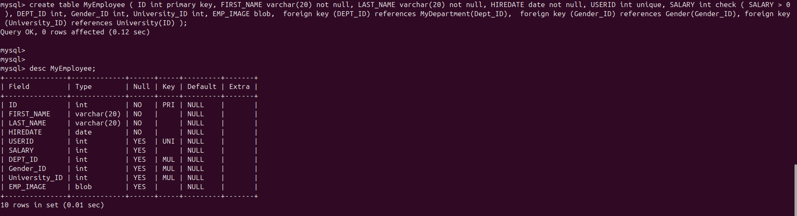

### Q2. Writing SQL queries to retrieve the data

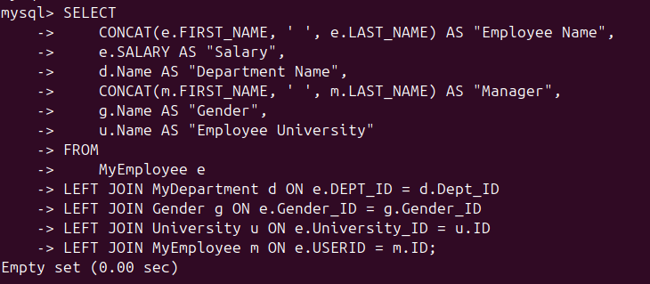

### Q3. Displaying job titles and monthly salary where total payroll exceeds 2500$ excluding sales employees


### Q4. Identifying the coding errors provided in the task 

The provided statment is as follows : 

```sql
SELECT empno, ename,
salary x 12 ANNUAL SALARY; FROM emp;
```
1. `salary x 12` using x as a multiplication opertator which isn't correct , `*` should be used instead of `x` .
2. Using the alias `ANNUAL SALARY` without putting it in a double quotes since it has a space. 
3. Misplaced semicolon after the `ANNUAL SALARY`.
4. Missing `AS` for the alias .

### Q5. Writing a function that gets the name and date of any hired employee after Scott

**Note that i solved this task on an Oracle online editor and that's because i solved the previous tasks on MySql , this one is required to be solved using Oracle**

Below is the code i wrote to solve this question
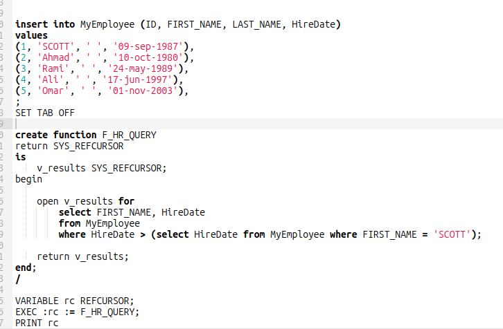

**I used `SET TAB OFF` in order to align the columns correctly , not necssary but it makes the view better.**

The output of the function i wrote :

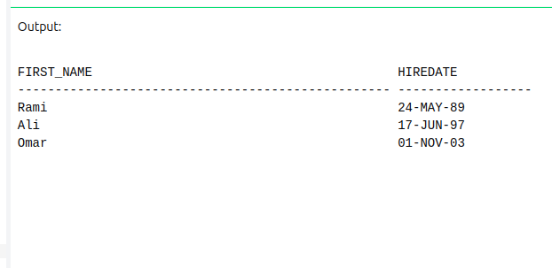

### Q6. Writing a procedure that copies data from the MyEmployee table to a new table MyEmployee_update


 I wrote the `delete from MyEmployee_update;` to make sure to empty the table always before copying , to ensure no duplicates when calling the function more than once.


## Tomcat

1. JVM is an environment that runs Java programs; it enables Java apps to run on different operating systems such as Windows and Linux without the need to change the code.
2. Application Server is a software platform that provides an environment for running apps and managing their functionality. 
3. WAR is a packed Java web program that contains everything the app requires, it makes delivering Java web apps simple and standard.

### Downloading Tomcat and Nginx , changing tomcat port to 7070 , setting a reverse proxy with Nginx so tomcat can be accessed through port 80 (http)

Firstly i changed tomcat default port from 8080 to 7070 as requested , i accessed the `server.xml` file from the directory `/opt/tomcat/conf` and changed the port to 8080.
**Note that i installed tomcat to */opt* because this directory is intended for third-party and optional software.**


Tomcat page can be accessed using the link `http://localhost:8080` or `http://127.0.0.1:8080` by default or `http://localhost:7070` or `http://127.0.0.1:7070` after changing the port .


Now in order to do the reverse proxy using Nginx ,I accessed the directory `/etc/nginx/sites-available` and edited the `default` file to add this in the follwing image :


 
After doing this, the service should be restarted using the command `sudo systemctl restart nginx` so that the changes can take effect.
 
We can see that the reverse proxy is working as required, and the Tomcat server was accessed through `http://127.0.0.1` without specifying port 7070.
 


This section covers the final part of the task, which is creating a Vagrant virtual machine to automatically provision an Ubuntu 24.04 environment with Java 8 and Apache Tomcat 9.

**Note that i executed this part on Windows instead of Ubuntu , that's because of nested virtualization limitations when running Vagrant inside a VirtualBox Linux , so i executed this part on my local machine which runs Windows to ensure proper virtualization.**

I  installed VirtualBox and Vagrant on my local machine which runs Windows. A directory named `vagrant` was created, containing the following files:

- `Vagrantfile`
- `provision.sh`

Started by opening the PowerShell inside the folder and used the command `vagrant up` which returned successfully as in the image below:

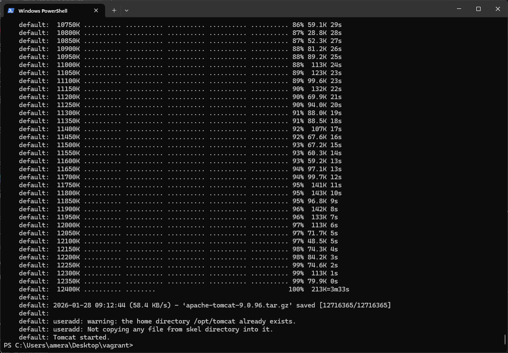

I accessed Tomcat via port 9090 from my local machine using the following URL : `http://localhost:9090` which was successful as in the image shown below:

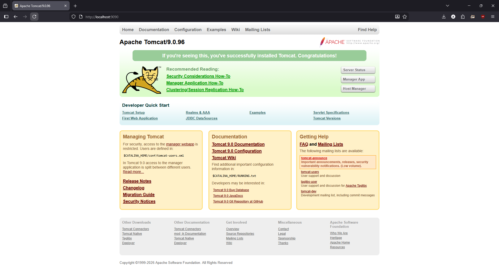

## DevOps

### Creating a Dockerfile for a Tomcat Docker image and deploying sample WAR then psuhing it into Docker registry

First of all i installed a sample WAR file as in the image below :

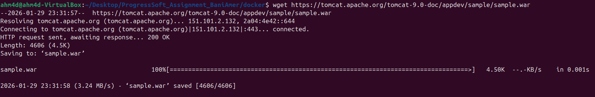

then i bulit the Tomcat docker image as shown below :

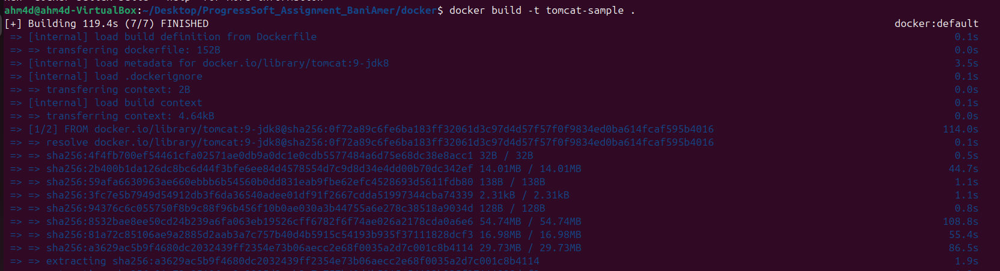

The image below shows the successful execution of the Tomcat Docker container using the `docker run` command.

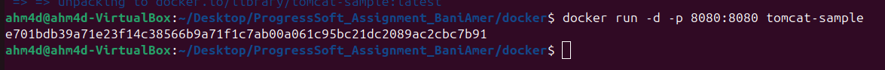

The image shows the sample WAR application successfully running on Apache Tomcat inside the Docker container.


Then i pushed the image to registry.


### Running Nginx and PostgreSQL as Docker containers.

#### Nginx

The image shows Nginx running successfully inside a Docker container.


**Note that the Nginx container was mapped to host port 8081 because the existing Nginx on my host system was running, while the service inside the container continued to run on its default port 80**

The image below shows the running Nginx on port 8081.


#### PostgreSQL 

The PostgreSQL container was configured with the username `ahm4d`, the password `ahm4d123`, and a database named `progresssoftdb`. The service was exposed on port 5432 to allow access from the host system.

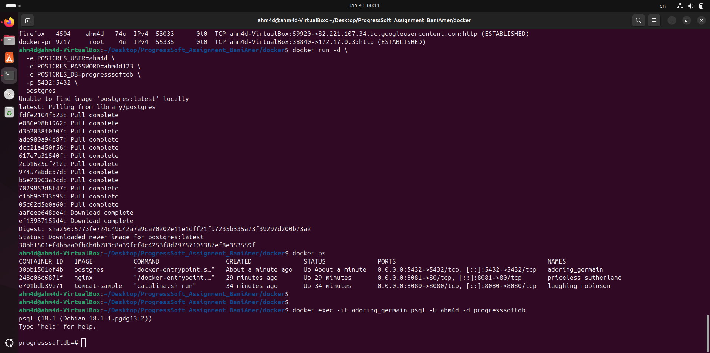

### Kubernetes

1. Kubernetes is an open-source platform used to manage containerized applications. It helps in deploying, scaling, and running containers across multiple machines automatically. Kubernetes ensures that applications keep running even if some containers or servers fail

2. Master Node

The master node is responsible for managing the Kubernetes cluster. It controls the cluster, schedules workloads, and keeps track of the overall system state. It does not usually run application containers.

Worker Node

The worker node runs the actual application containers. It receives instructions from the master node and executes them by running Pods and services.

To identify the Master or Worker node , we can use the following command `kubectl get nodes` and the master node will be labeled as Master and the ones without a label is the Worker.

#### Deploying a sample service

The screenshot demonstrates the use of kubectl commands to create, expose, and verify a Kubernetes deployment on a MicroK8s cluster.

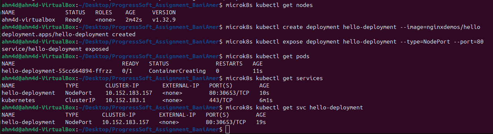

The image below verfies that the deployed Kubernetes is working.


